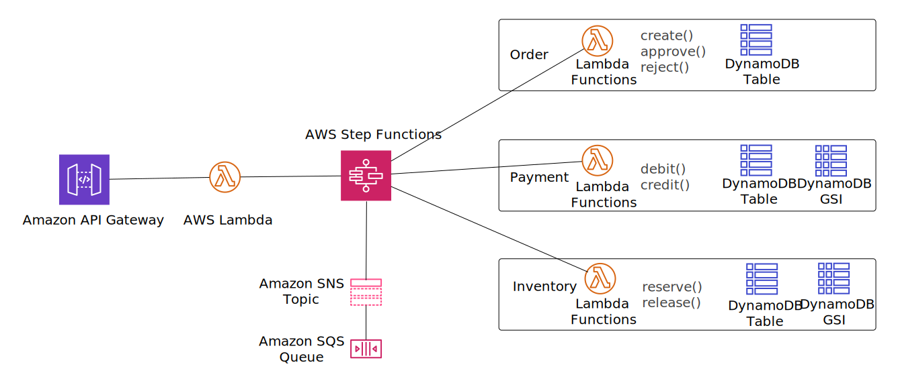
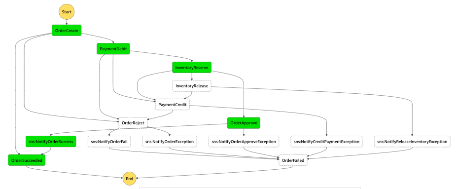

# Serverless Microserviecs: Saga Transaction

Implementation of Serverless Microservices Transaction using AWS Step Functions.

AWS Services Relationship


State Machine  


## Deploying

### Requirements
- AWS Account
- Python 3.7 or greater
- AWS CLI latest

### Use
- AWS Lambda
- AWS Step Functions
- Amazon DynamoDB
- AWS SNS
- AWS SQS
- Amazon API Gateway
- AWS IAM
- AWS CloudFormation

# Instructions

These are the deployment steps until the full implementation is complete.:

1. Clone this repository locally.
2. Execute the following command in a terminal running python3.

__Set variables__  
```bash
$ PROJECTNAME=serverless-saga
$ YOURNAME=yagita
$ YOURMAILADDR=xxxxxx@xxx.com
```

__Create a bucket to upload lambda functions.__
```bash
$ aws s3 mb s3://$YOURNAME-$PROJECTNAME
```

__Install python package.__
```bash
$ cd lambda/layer/python
$ pip install -r requirements.txt -t .
$ cd ../../..
```

__Upload local artifacts__
```bash
$ aws cloudformation package \
    --template-file saga-sfn.yml \
    --s3-bucket $YOURNAME-$PROJECTNAME \
    --output-template-file packaged.yml

$ aws cloudformation deploy \
    --stack-name $PROJECTNAME \
    --region ap-northeast-1 \
    --template-file packaged.yml \
    --capabilities CAPABILITY_NAMED_IAM \
    --output text \
    --parameter-overrides \
        NotifyEmail=$YOURMAILADDR
```

# How to Test

```bash
$ aws lambda invoke \
    --function-name TestSfnFunction \
    --region ap-northeast-1 \
    --payload '{}' \
    response.json
```

__sample event data__
```json
{
  "order_id": "40063fe3-56d9-4c51-b91f-71929834ce03",
  "order_date": "2019-12-01 12:32:24.927479",
  "customer_id": "2d14eb6c-a3c2-3412-8450-239a16f01fea",
  "items": [{
      "item_id": "0123",
      "qty": 1.0,
      "description": "item 1",
      "unit_price": 12.99
    },
    {
      "item_id": "0234",
      "qty": 2.0,
      "description": "item 2",
      "unit_price": 41.98
    },
    {
      "item_id": "0345",
      "qty": 3.0,
      "description": "item 3",
      "unit_price": 3.50
    }
  ]
}
```
